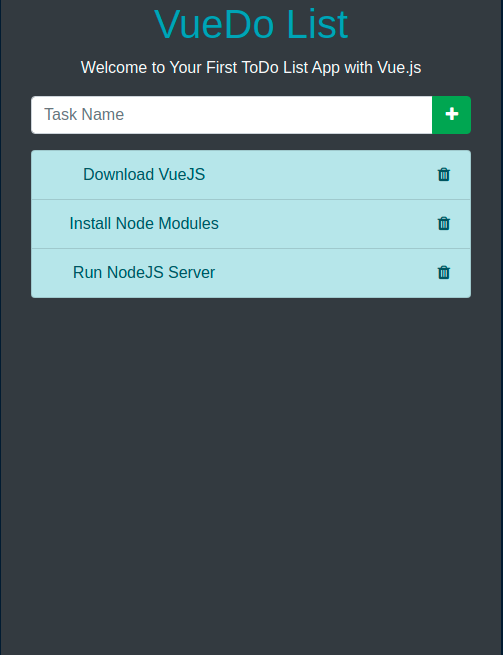
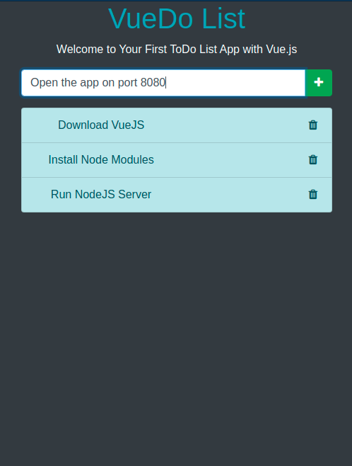

# VueDo-List  
> ToDo List app using VueJS

## Build Setup

``` bash
# install dependencies
npm install

# serve with hot reload at localhost:8080
npm run dev

# build for production with minification
npm run build
```

## Screenshots

### Update: 17 MAY 2021


### Initial:
    
